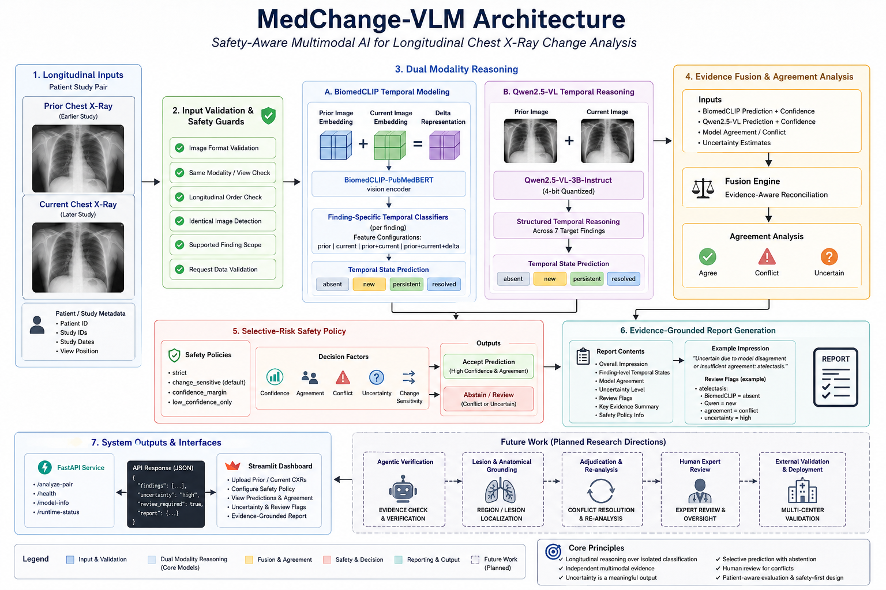

# MedChange-VLM System Architecture

## 1. Overview

MedChange-VLM is a safety-aware multimodal research system for longitudinal chest X-ray analysis.

Instead of interpreting a chest radiograph independently, the system receives two studies from the same patient:

- a **prior chest X-ray**
- a **current chest X-ray**

and estimates how predefined radiographic findings changed between the two studies.

For every supported finding, the system reasons over four temporal states:

| State | Meaning |
|---|---|
| `absent` | Finding is absent in both prior and current studies |
| `new` | Finding is absent in the prior study and present in the current study |
| `persistent` | Finding is present in both studies |
| `resolved` | Finding is present in the prior study and absent in the current study |

The core architecture combines two independent evidence pathways:

1. **BiomedCLIP-based temporal classification**
2. **Qwen2.5-VL multimodal temporal reasoning**

Their outputs are reconciled through an evidence-fusion layer and subsequently processed by a configurable selective-risk safety policy.

The system may therefore return either:

- an accepted temporal prediction, or
- an uncertain result requiring review.

This architecture intentionally treats abstention as valid system behavior.

---

# 2. High-Level Architecture



The implemented pipeline can be summarized as:

```text
Prior Chest X-Ray
        +
Current Chest X-Ray
        │
        ▼
Input Validation
        │
        ▼
 ┌──────┴──────┐
 │             │
 ▼             ▼
BiomedCLIP   Qwen2.5-VL
Temporal     Temporal
Modeling     Reasoning
 │             │
 └──────┬──────┘
        ▼
Evidence Fusion
        │
        ▼
Agreement / Conflict Analysis
        │
        ▼
Selective-Risk Safety Policy
        │
   ┌────┴────┐
   │         │
 Accept    Abstain
   │         │
   │      Review Flag
   └────┬────┘
        ▼
Evidence-Grounded Report
        │
 ┌──────┴───────┐
 ▼              ▼
FastAPI      Streamlit
```

---

# 3. Validated Finding Scope

MedChange-VLM v0.1.0 is restricted to seven target findings:

```text
atelectasis
cardiomegaly
consolidation
edema
pleural_effusion
pneumonia
pneumothorax
```

The restricted scope is deliberate.

The system should not be interpreted as a general-purpose chest X-ray diagnostic model.

Findings outside this predefined set have not been evaluated by the current MedChange pipeline.

---

# 4. Longitudinal Input Layer

The fundamental input unit is a longitudinal study pair:

```text
Patient
│
├── Prior study
│   └── Prior chest X-ray
│
└── Current study
    └── Current chest X-ray
```

Associated metadata can include:

```text
pair_id
prior_study_id
current_study_id
patient identifier
study ordering
view position
```

The prior study must chronologically precede the current study.

The system operates on paired images rather than independent single-image inference.

---

# 5. Input Validation and Safety Guards

Before model inference, MedChange-VLM validates the incoming pair.

The validation layer protects the downstream inference pipeline from malformed or unsupported inputs.

Checks include:

- file existence
- image decoding
- supported image format
- image dimensions
- uploaded content type
- request metadata validation
- identical-file detection
- longitudinal pair consistency
- supported safety-policy configuration

Conceptually:

```text
Uploaded files
      │
      ▼
File validation
      │
      ▼
Image decoding
      │
      ▼
Pair validation
      │
      ▼
Safety configuration validation
      │
      ▼
Inference
```

If validation fails, inference is not started.

This is particularly important because multimodal foundation models can otherwise attempt to process invalid or unintended input without producing an obvious system-level failure.

---

# 6. BiomedCLIP Temporal Modeling

## 6.1 Vision Encoder

The first evidence pathway uses:

```text
microsoft/
BiomedCLIP-PubMedBERT_256-vit_base_patch16_224
```

BiomedCLIP provides biomedical image representations for the prior and current radiographs.

For a longitudinal pair:

```text
Prior image   → E_prior
Current image → E_current
```

A temporal difference representation can then be constructed:

```text
E_delta = E_current - E_prior
```

This provides three potential feature groups:

```text
prior representation
current representation
delta representation
```

---

## 6.2 Finding-Specific Temporal Models

Temporal classifiers operate independently for each supported finding.

The project evaluates feature configurations such as:

```text
prior
current
delta
prior + current
prior + current + delta
```

The selected feature representation may differ between findings.

Example:

```text
Prior embedding
       +
Current embedding
       +
Delta embedding
       │
       ▼
Finding-specific temporal classifier
       │
       ▼
absent / new / persistent / resolved
```

This design allows the temporal classifier to learn whether absolute image representations, longitudinal differences, or their combination are most informative for a particular finding.

---

# 7. Qwen2.5-VL Temporal Reasoning

## 7.1 Model

The second evidence pathway uses:

```text
Qwen/Qwen2.5-VL-3B-Instruct
```

The model is used with quantization in the local research workflow to reduce GPU memory requirements.

Unlike the BiomedCLIP pathway, Qwen receives both radiographs within a multimodal reasoning context.

Conceptually:

```text
Prior X-ray
     +
Current X-ray
     +
Structured temporal prompt
        │
        ▼
Qwen2.5-VL
        │
        ▼
Structured longitudinal output
```

---

## 7.2 Structured Temporal Reasoning

Qwen is instructed to reason only over the supported target findings.

Expected states are constrained to:

```text
absent
new
persistent
resolved
```

A structured output resembles:

```json
{
  "findings": [
    {
      "finding": "atelectasis",
      "change": "new"
    },
    {
      "finding": "cardiomegaly",
      "change": "absent"
    }
  ],
  "overall_change": "new"
}
```

The actual system expects all supported findings.

---

# 8. Robust VLM Output Parsing

Foundation-model outputs cannot automatically be assumed to follow the requested schema.

MedChange-VLM therefore contains a parsing and validation stage.

```text
Raw Qwen output
      │
      ▼
JSON extraction
      │
      ▼
Schema validation
      │
      ▼
Finding validation
      │
      ▼
Temporal-state validation
      │
      ▼
Structured prediction
```

Malformed or invalid outputs are handled explicitly rather than silently interpreted.

This separates:

```text
language generation
```

from:

```text
system-level structured reasoning
```

and prevents malformed text from propagating directly into the fusion layer.

---

# 9. Independent Evidence Principle

An important architectural decision is that BiomedCLIP and Qwen remain separate evidence sources.

The architecture is therefore:

```text
Image pair
   │
   ├──────────────► BiomedCLIP temporal prediction
   │
   └──────────────► Qwen temporal prediction
```

rather than:

```text
Model A → Model B → final answer
```

This separation makes disagreement observable.

For example:

```text
BiomedCLIP : absent
Qwen       : new
```

is retained as a conflict rather than automatically allowing one model to overwrite the other.

---

# 10. Evidence Fusion

The fusion layer receives finding-level outputs from both model pathways.

For every finding it can consider:

```text
BiomedCLIP temporal state
BiomedCLIP confidence

Qwen temporal state
Qwen confidence

agreement state
uncertainty
safety configuration
```

The resulting structured object contains information such as:

```text
finding
final_state
biomedclip_state
qwen_state
biomedclip_confidence
qwen_confidence
agreement
uncertainty
requires_review
evidence
decision_reason
```

This object becomes the primary representation used by downstream reporting and API layers.

---

# 11. Agreement Analysis

Model relationships are categorized conceptually as:

```text
agreement
conflict
uncertain / insufficient evidence
```

### Agreement

Example:

```text
BiomedCLIP = absent
Qwen       = absent
```

### Conflict

Example:

```text
BiomedCLIP = absent
Qwen       = new
```

### Uncertainty

A result may also become uncertain when confidence or configured safety requirements are insufficient to support an automated conclusion.

Agreement is therefore treated as an explicit architectural signal rather than an incidental property of the predictions.

---

# 12. Selective-Risk Safety Layer

The safety layer determines whether the fused result should be automatically returned or abstained.

Supported research policies include:

```text
strict
change_sensitive
confidence_margin
low_confidence_only
```

The policy can also use a configurable confidence threshold.

Conceptually:

```text
Fused prediction
      │
      ▼
Safety policy
      │
      ├─────────► sufficiently supported
      │                 │
      │                 ▼
      │          Accept prediction
      │
      └─────────► conflict / uncertainty
                        │
                        ▼
                     Abstain
                        │
                        ▼
                   Review flag
```

---

# 13. Change-Sensitive Safety

The `change_sensitive` policy is particularly relevant for longitudinal analysis.

Incorrectly predicting a change can be more consequential than identifying a stable finding incorrectly.

The policy can therefore treat states such as:

```text
new
resolved
persistent
```

more cautiously when multimodal evidence conflicts.

Example:

```text
Finding             : atelectasis
BiomedCLIP           : absent
Qwen                 : new
Agreement            : conflict
Uncertainty          : high
Safety policy        : change_sensitive
Threshold            : 0.80

Final state          : uncertain
Requires review      : True
```

This makes the safety policy part of the decision pipeline rather than an informational label added after inference.

---

# 14. Abstention as a First-Class Output

Traditional classifiers generally force one of their supported classes.

MedChange-VLM additionally permits:

```text
uncertain
```

at the system level.

This distinction is important.

The underlying temporal classes remain:

```text
absent
new
persistent
resolved
```

but the final safety-aware system can decline to commit to one when the evidence is insufficient.

Thus:

```text
uncertain ≠ fifth biological temporal state
```

Instead:

```text
uncertain = system-level abstention decision
```

---

# 15. Human Review Routing

When the safety layer abstains, the finding receives:

```text
requires_review = True
```

The report then exposes why review was requested.

Example:

```text
atelectasis:

BiomedCLIP = absent
Qwen       = new

agreement   = conflict
uncertainty = high

review required
```

The current research prototype surfaces this information through the API and dashboard.

It does not perform autonomous clinical adjudication.

---

# 16. Evidence-Grounded Report Generation

The reporting layer operates on the structured fused prediction.

It does not independently reinterpret the images to invent a new diagnosis.

The report contains information such as:

```text
overall change
finding-level temporal states
model agreement
uncertainty
review flags
evidence
decision reason
impression
```

Representative output:

```text
Overall change : uncertain
Uncertainty    : high
Review needed  : True

IMPRESSION

Uncertain due to model disagreement or insufficient
agreement: atelectasis.

UNCERTAIN / CONFLICTING FINDINGS

- atelectasis:
  The current image shows a more prominent opacity
  compared with the prior image.

REVIEW FLAGS

- atelectasis:
  BiomedCLIP=absent
  Qwen=new
  agreement=conflict
  uncertainty=high
```

The report therefore exposes the underlying reasoning state rather than presenting only a final label.

---

# 17. FastAPI Service

The inference pipeline is exposed through a FastAPI application.

Primary endpoints include:

```text
GET  /health
GET  /model-info
GET  /runtime-status

POST /analyze-pair
POST /cache/clear
```

The main inference endpoint accepts:

```text
prior image
current image

pair_id
prior_study_id
current_study_id

safety_policy
safety_threshold
```

and returns structured longitudinal analysis.

---

# 18. Runtime Management

Multimodal inference can require significant CPU/GPU resources.

MedChange-VLM therefore contains runtime management rather than allowing uncontrolled concurrent model execution.

Conceptually:

```text
Request
   │
   ▼
Runtime manager
   │
   ├── available ──► inference
   │
   └── busy ───────► retryable 503
```

Runtime status tracks information such as:

```text
busy
total requests
successful requests
failed requests
cache hits
active request
```

This improves the behavior of the research service under repeated or overlapping requests.

---

# 19. Request Caching

Repeated analysis of the same input pair with the same configuration can be expensive.

A request cache therefore uses a key derived from relevant request inputs and configuration.

Conceptually:

```text
Image pair
+
Study identifiers
+
Safety configuration
       │
       ▼
Request cache key
       │
   ┌───┴────┐
   │        │
  Hit      Miss
   │        │
Return    Run models
cached      │
result      ▼
          Cache
```

Caching reduces unnecessary repeated multimodal inference during development and demonstration.

---

# 20. Streamlit Dashboard

The Streamlit dashboard provides the interactive research interface.

Its responsibilities include:

- prior/current image upload
- API status display
- pair metadata input
- safety-policy configuration
- temporal result visualization
- model-agreement display
- uncertainty visualization
- review-flag display
- evidence-grounded report presentation
- validated-scope disclosure

The dashboard is a presentation layer.

The underlying reasoning and safety logic remains in the MedChange system rather than being duplicated in the interface.

---

# 21. Patient-Aware Evaluation Architecture

Biomedical evaluation must avoid patient leakage.

If images from the same patient appear in both training and testing sets, measured performance may be overly optimistic.

MedChange-VLM therefore uses patient-aware splitting.

```text
Patients
   │
   ├────────► Training patients
   │
   ├────────► Validation patients
   │
   └────────► Test patients
```

with:

```text
patient overlap = 0
```

for the corresponding patient-disjoint experiments.

This principle is used throughout the temporal evaluation workflow.

---

# 22. Evaluation Layers

Evaluation occurs at multiple levels.

## Model-level evaluation

```text
BiomedCLIP
Qwen2.5-VL
```

## Fusion-level evaluation

```text
MedChange
```

## Finding-level metrics

```text
accuracy
macro F1
state recall
coverage
abstention rate
covered error rate
review rate
```

## Pair-level metrics

```text
exact pair match
pair abstention rate
pair review rate
fully covered pairs
mean covered findings
```

## Safety analysis

```text
risk vs coverage
policy comparison
threshold comparison
```

This prevents a single aggregate accuracy number from hiding failure modes.

---

# 23. Why Macro F1 and State Recall Matter

Longitudinal chest X-ray states are strongly imbalanced.

For example, many findings remain:

```text
absent → absent
```

while:

```text
new
persistent
resolved
```

occur less frequently.

A model that predicts `absent` for almost everything can therefore achieve misleadingly high accuracy.

For this reason, the evaluation architecture emphasizes:

```text
macro F1
per-state recall
coverage
error among covered predictions
```

alongside accuracy.

---

# 24. Experimental QLoRA Branch

The project also contains an experimental QLoRA adaptation workflow for Qwen2.5-VL.

This branch is **not part of the default MedChange inference architecture in v0.1.0**.

The experimental path is:

```text
Longitudinal pairs
       │
       ▼
Patient-aware SFT dataset
       │
       ▼
Change-aware sampling
       │
       ▼
QLoRA adaptation
       │
       ▼
Held-out temporal evaluation
```

The implementation explores:

```text
4-bit quantization
LoRA rank = 8
LoRA alpha = 16
LoRA dropout = 0.05

target modules:
q_proj
k_proj
v_proj
o_proj
```

Assistant-only supervision is used so that training loss is applied to the intended response portion rather than the complete multimodal prompt.

---

# 25. Why Experimental QLoRA Is Disabled

The larger QLoRA smoke experiment produced low language-model validation loss but collapsed toward the dominant `absent` temporal state during held-out evaluation.

Observed evaluation behavior included:

```text
Accuracy       ≈ 0.891
Macro F1       ≈ 0.236

Absent recall      = 1.000
New recall         = 0.000
Persistent recall  = 0.000
Resolved recall    = 0.000
```

Therefore:

```text
low training/evaluation language-model loss
```

did not imply:

```text
good temporal-state discrimination
```

The adapter was consequently not promoted into the production research inference path.

This distinction is an intentional part of the architecture.

---

# 26. Current v0.1.0 Architecture

The completed v0.1.0 system is:

```text
Longitudinal input
       │
       ▼
Validation
       │
       ├──────────────┐
       ▼              ▼
BiomedCLIP         Qwen2.5-VL
       │              │
       └──────┬───────┘
              ▼
        Evidence fusion
              │
              ▼
      Agreement analysis
              │
              ▼
       Safety / abstention
              │
              ▼
      Grounded reporting
              │
       ┌──────┴──────┐
       ▼             ▼
    FastAPI       Streamlit
```

---

# 27. Planned Architecture Extensions

The following components are research directions and are **not implemented as validated v0.1.0 capabilities**.

## 27.1 Lesion and Anatomical Grounding

Future work may connect finding-level temporal states with spatial evidence.

Potential architecture:

```text
Temporal finding
      │
      ▼
Grounding model
      │
      ▼
Anatomical region / lesion localization
      │
      ▼
Prior-current spatial comparison
```

Potential techniques include:

```text
bounding boxes
segmentation
attention maps
region-level embeddings
grounding-aware VLMs
```

---

## 27.2 Agentic Verification

A future verification layer may introduce specialized reasoning components.

Conceptually:

```text
Initial prediction
       │
       ▼
Evidence verifier
       │
       ▼
Conflict detector
       │
       ▼
Targeted re-analysis
       │
       ▼
Adjudication
       │
       ▼
Accept / human escalation
```

The objective would be evidence verification, not unrestricted autonomous decision making.

---

## 27.3 External Validation

Future evaluation should extend beyond the development dataset.

Desired validation includes:

```text
external chest X-ray datasets
different acquisition systems
different institutions
different patient populations
expert longitudinal annotations
```

Prospective clinical validation would be required before considering any clinical use.

---

# 28. Architecture Principles

The MedChange-VLM architecture follows several core principles.

## Longitudinal-first reasoning

The primary task is change over time rather than independent image classification.

## Independent multimodal evidence

BiomedCLIP and Qwen provide separate evidence streams.

## Explicit disagreement

Model conflict is retained rather than hidden.

## Uncertainty as meaningful output

The system can explicitly state that evidence is insufficient.

## Selective prediction

Not every input must receive an automated conclusion.

## Human review

High-risk or conflicting cases can be routed for review.

## Patient-aware evaluation

Patient identity is respected when constructing evaluation splits.

## Structured outputs

Foundation-model text is parsed and validated before downstream use.

## Transparent experimental failure

Experimental components are evaluated by downstream task performance rather than training loss alone.

---

# 29. Research Scope and Safety Boundary

MedChange-VLM is a research prototype.

The architecture has not been clinically validated and must not be interpreted as a medical diagnostic system.

The current implementation does **not** provide:

```text
clinical diagnosis
treatment recommendations
radiologist replacement
general chest X-ray interpretation
regulatory-grade medical-device functionality
```

Its purpose is to investigate:

```text
longitudinal multimodal reasoning
temporal medical-image modeling
model agreement
uncertainty
selective prediction
evidence-grounded reporting
```

in a reproducible research system.

---

# 30. Summary

MedChange-VLM combines:

```text
longitudinal chest X-ray pairing
            +
biomedical visual representation learning
            +
multimodal VLM reasoning
            +
evidence fusion
            +
uncertainty estimation
            +
selective-risk safety
            +
human-review routing
            +
structured reporting
```

The central architectural idea is not simply to produce another prediction.

It is to make the system capable of distinguishing between:

```text
"I have sufficient evidence to make this prediction."
```

and:

```text
"The available models disagree or the evidence is
insufficient, so this case should be reviewed."
```

That distinction forms the core of the MedChange-VLM v0.1.0 architecture.